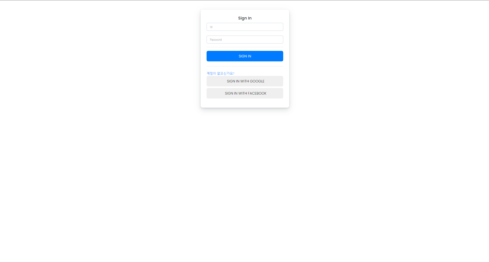
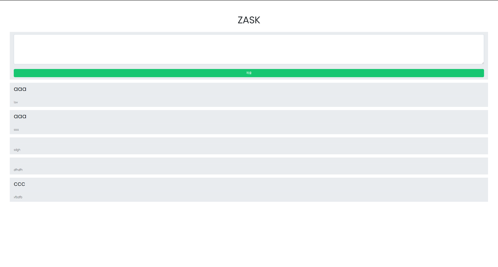

# ZAVaScr
NodeJS-based Open Source Community  


  

## Run
```
npm i express ejs body-parser cookie-parser jsonwebtoken socket.io nedb express-session connect-nedb-session   
node index.js
```

## Introduction to the Project
There are not many open source online communities developed with NodeJS.   
So I created a NodeJS-based online community.   
The project aims to make easier for personal users to create NodeJS-based online communities.  

### Developer
** DipokalHHJ **  
Hello, I'm DipokalHHJ, a youth developer living in Korea.
